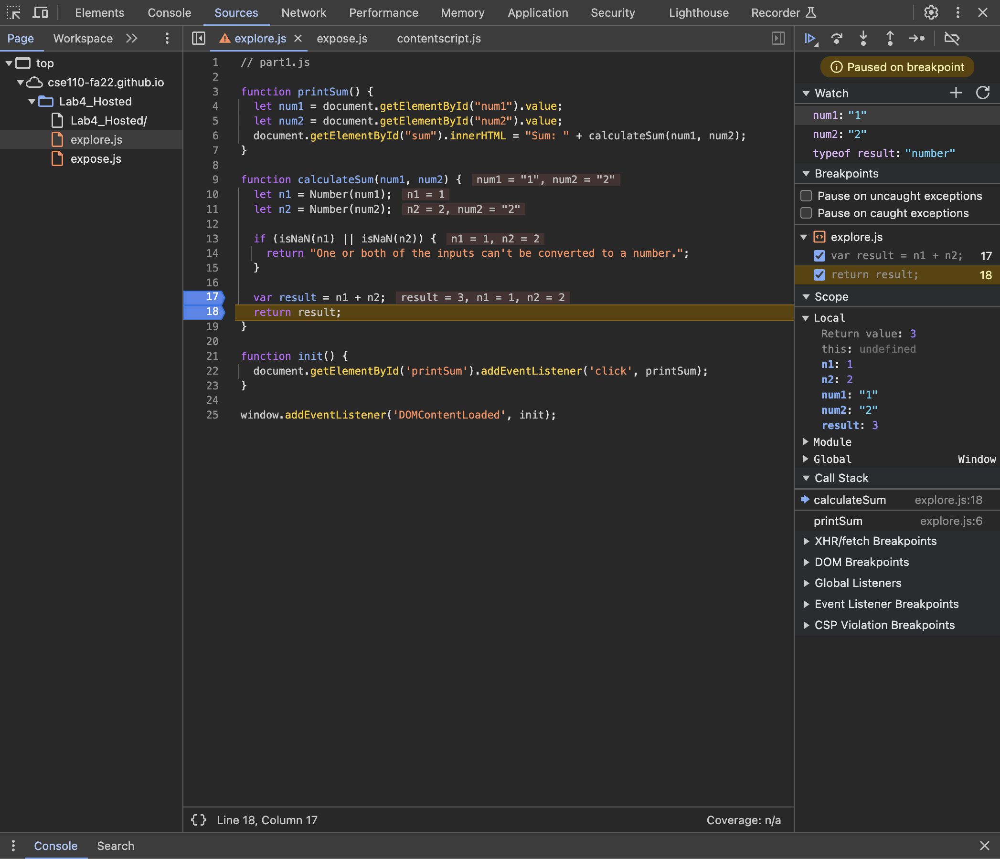

1. The bug was that there was no conversion of string to number prior to addition. The two inputs were being string concatenated instead of being added. 
2. To fix it, I added a check for type and converted strings wherever possible so that they could be summed instead of concatenated. 
Here is an image showing the fix:
